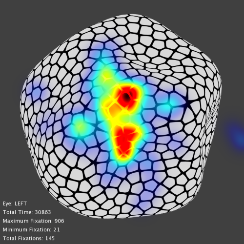

## Heatmap Generator ##

Generates heatmaps for eyetracking data fed in text format from EyeLink.

Required input in text file:
`TRIAL_INDEX`
`LEFT_IMAGE`
`RIGHT_IMAGE`
`SAME`
`EYE_USED`
`KEY_PRESSED`
`RESPONSE_TIME`
`TRIAL_FIXATION_TOTAL`
`CURRENT_FIX_INDEX`
`CURRENT_FIX_DURATION`
`CURRENT_FIX_X`
`CURRENT_FIX_Y`
`CURRENT_FIX_PUPIL`

Data must be supplied as TSV (Tab Seperated Values) into `main.m`

### Usage ###

To use please add in the colormaps, curvemaps and normalmaps of the images used in the eyetracking experiment into `images/`, `images/curvemaps/` and `images/normalmaps` respectively.

Further settings can be found in `settings.m`.

To run:
    $ main(<filename>);

Example of heatmap created:

